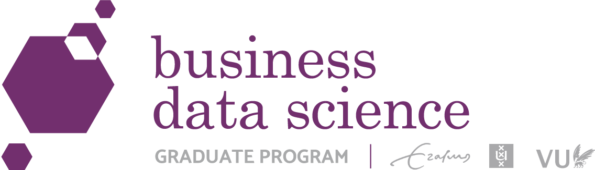

## {.center}

:::: {.columns}

::: {.column width="50%"}

{style="box-shadow:none; border:none" width=300}
{style="box-shadow:none; border:none" width=300}

:::

::: {.column width="50%"}

{style="box-shadow:none; border:none;" width=350}

:::

::::

## Finn-Ole Höner {.center}

**PhD Candidate in Quantitative Marketing (ESE)**

:::: {.columns}

::: {.column width="35%" .center}

{width=90%}

:::

::: {.column width="65%"}

LLMs for Innovation:

- Ideation with AI Agent teams (Dr. van Crombrugge, Dr. Wichmann, Prof. Stremersch)
- Refining and validating ideas for marketing texts (Prof. Donkers, Prof. Fok)
- Synthetic respondents for sensitive topics (Prof. de Jong, Prof. Pieters)

:::

::::

**Background:**  
BDS, Deutsche Bundesbank, Lidl, University of Tübingen

# Why do we care? {.center}

## {.center .r-fit-text}

A [*Nature*](https://www.nature.com/articles/d41586-023-02980-0) survey of scientists found that ...

```{r}
#| fig-align: center
library(tidyverse)
# assisted by Cursor AI
# Replicate Nature's 'Benefits of Generative AI' bar plot
ddBenefits <- data.frame(
  sBenefit = c(
    "Helps researchers without English as a first language",
    "Makes coding easier and faster",
    "Summarizes other research to save time reading it",
    "Speeds administrative tasks",
    "Helps write manuscripts faster",
    "Improves scientific search",
    "Helps creative work by brainstorming new ideas",
    "Generates new research hypotheses",
    "Helps peer-review manuscripts faster",
    "Other"
  ),
  dPercent = c(56, 45, 40, 38, 35, 33, 28, 18, 13, 3)
)

lOrder <- ddBenefits$sBenefit[order(ddBenefits$dPercent, decreasing = TRUE)]

ggplot(ddBenefits, aes(x = reorder(sBenefit, dPercent), y = dPercent)) +
  geom_col(fill = "#d2693a") +
  coord_flip() +
  scale_y_continuous(labels = function(x) paste0(x, "%"), limits = c(0, 60)) +
  labs(
    title = "Benefits of Generative AI",
    subtitle = "Q: What do you think are currently the biggest benefits of generative AI for research?",
    x = NULL,
    y = NULL
  ) +
  theme_minimal(base_size = 13) +
  theme(
    plot.title = element_text(face = "bold"),
    axis.text.x = element_blank(),
    axis.ticks.x = element_blank(),
    panel.grid.major.y = element_blank(),
    panel.grid.minor = element_blank()
  )
```


## {background-iframe="https://openai.com/index/new-result-theoretical-physics/" interactive=true}

## {background-image="../../assets/videos/epoch_ai.png"}

## {background-iframe="https://finnoh.github.io/ws_genai_eb/" interactive=true}

---

## Q1 Programming AI use (n=25)

```{r}
#| fig-align: center
q1 <- data.frame(
  category = c(
    "No AI coding use",
    "Copy-paste assistants",
    "IDE assistants",
    "Coding agents"
  ),
  count = c(7, 13, 6, 8)
)

q1$category <- factor(q1$category, levels = q1$category)

ggplot(q1, aes(x = category, y = count, fill = category)) +
  geom_col(width = 0.7, show.legend = FALSE) +
  geom_text(aes(label = paste0(round(100 * count / 25), "%")), vjust = -0.3, size = 5) +
  scale_fill_manual(values = c("#6c757d", "#d2693a", "#5b8e7d", "#2f5597")) +
  labs(x = NULL, y = "Participants") +
  ylim(0, 15) +
  theme_minimal(base_size = 16) +
  theme(axis.text.x = element_text(angle = 10, hjust = 1))
```

- Course link: onboarding, LLM basics, verification loop

---

## Q2 AI use in research

```{r}
#| fig-align: center
q2 <- data.frame(
  category = c(
    "Ideation / brainstorming",
    "Literature search / review",
    "Writing assistance",
    "Modeling",
    "Data collection / scraping",
    "Data simulation",
    "No AI use"
  ),
  count = c(18, 18, 17, 8, 7, 2, 2)
)

q2$category <- factor(q2$category, levels = rev(q2$category))

ggplot(q2, aes(x = category, y = count, fill = count)) +
  geom_col(width = 0.7, show.legend = FALSE) +
  geom_text(aes(label = paste0(round(100 * count / 25), "%")), hjust = -0.15, size = 5) +
  scale_fill_gradient(low = "#f0c9b7", high = "#c65a2e") +
  coord_flip() +
  labs(x = NULL, y = "Participants") +
  ylim(0, 21) +
  theme_minimal(base_size = 15)
```

- Course link: ideation, literature review, writing, analysis, data collection

---

## Q3 Top priorities (free text)

```{r}
#| fig-align: center
q3 <- data.frame(
  theme = c(
    "Coding agents / tools",
    "Research applications",
    "Foundations",
    "Workflow integration",
    "Verification and safety"
  ),
  count = c(13, 13, 9, 9, 8)
)

q3$theme <- factor(q3$theme, levels = rev(q3$theme))

ggplot(q3, aes(x = theme, y = count, fill = theme)) +
  geom_col(width = 0.7, show.legend = FALSE) +
  geom_text(aes(label = count), hjust = -0.15, size = 5) +
  scale_fill_manual(values = c("#2f5597", "#3e7a6a", "#d2693a", "#8f6f9a", "#9c3d3d")) +
  coord_flip() +
  labs(x = NULL, y = "Mentions") +
  ylim(0, 15) +
  theme_minimal(base_size = 15)
```

- Course link: tools, tool building, memory, rigorous analysis, workflows

---

## Q4 Laptop mix

```{r}
#| fig-align: center
q4 <- data.frame(
  laptop = c("Windows", "Mac"),
  count = c(14, 11)
)

ggplot(q4, aes(x = laptop, y = count, fill = laptop)) +
  geom_col(width = 0.6, show.legend = FALSE) +
  geom_text(aes(label = paste0(round(100 * count / 25), "%")), vjust = -0.3, size = 5) +
  scale_fill_manual(values = c("#2f5597", "#d2693a")) +
  labs(x = NULL, y = "Participants") +
  ylim(0, 16) +
  theme_minimal(base_size = 16)
```

- Course link: setup support and in-class troubleshooting

---

## Q5 Paid subscriptions

```{r}
#| fig-align: center
q5 <- data.frame(
  subscription = c("Paid plan", "No paid plan"),
  count = c(16, 9)
)

ggplot(q5, aes(x = subscription, y = count, fill = subscription)) +
  geom_col(width = 0.6, show.legend = FALSE) +
  geom_text(aes(label = paste0(round(100 * count / 25), "%")), vjust = -0.3, size = 5) +
  scale_fill_manual(values = c("#3e7a6a", "#b8bec4")) +
  labs(x = NULL, y = "Participants") +
  ylim(0, 18) +
  theme_minimal(base_size = 16)
```

- Course link: local and open workflows; no paid-only requirements

---

## Q6 Direct API experience

```{r}
#| fig-align: center
q6 <- data.frame(
  api_experience = c("Used API", "No API use"),
  count = c(8, 17)
)

ggplot(q6, aes(x = api_experience, y = count, fill = api_experience)) +
  geom_col(width = 0.6, show.legend = FALSE) +
  geom_text(aes(label = paste0(round(100 * count / 25), "%")), vjust = -0.3, size = 5) +
  scale_fill_manual(values = c("#d2693a", "#6c757d")) +
  labs(x = NULL, y = "Participants") +
  ylim(0, 19) +
  theme_minimal(base_size = 16)
```

- Course link: tool calls first, MCP builder second

---

## Q7 Language profile

```{r}
#| fig-align: center
q7 <- data.frame(
  language = c("Stata", "R", "Python", "MATLAB", "No programming"),
  count = c(20, 12, 8, 3, 3)
)

q7$language <- factor(q7$language, levels = rev(q7$language))

ggplot(q7, aes(x = language, y = count, fill = language)) +
  geom_col(width = 0.7, show.legend = FALSE) +
  geom_text(aes(label = paste0(round(100 * count / 25), "%")), hjust = -0.15, size = 5) +
  scale_fill_manual(values = c("#9aa2a9", "#4f6d8a", "#d2693a", "#3e7a6a", "#2f5597")) +
  coord_flip() +
  labs(x = NULL, y = "Participants") +
  ylim(0, 22) +
  theme_minimal(base_size = 15)
```

- Course link: language-flexible workflows, tool-first demos, verification habits

---

## Q8 Comments, wishes, questions

- Requests: Stata fit, multi-agent practice, security guidance
- Concern: restricted data leakage when using agents
- Course link: privacy-by-design and permission-restricted modes

## (A necessary) Disclaimer

1) Massive amounts of work on this topic are happening right now
2) Many, many (legal, ethical, environmental, social) questions are open
3) AI is fuzzy + a lot of hype

Wide overview -> Experiment on your own!

# Meet Jan: AI tutor for this course! {.center}

Github: `finnoh/ti-student-agent-pack`

```
You: I want to work on E03.

Jan: +------------------------------------------+
     | Exercise E03 - Context + Retrieval      |
     | Objective: Compare baseline vs retrieval|
     | Deliverable: A/B note + cited chunk     |
     +------------------------------------------+

     First step: run the baseline (no retrieval)
     and paste the output so we can compare fairly.
```

---

**Installation:**

```bash
curl -sL https://raw.githubusercontent.com/finnoh/ti-student-agent-pack/main/install.sh | bash
```

## {background-video="../../assets/videos/jan_install.mp4" background-size="contain" background-video-loop="true"}

## How to Use Jan

1. Open a terminal
2. `cd path/to/student-agent-pack`
3. `opencode`

## {background-video="../../assets/videos/opencode_desktop.mp4" background-size="contain" background-video-loop="true"}

## {background-video="../../assets/videos/how_to_use_jan.mp4" background-size="contain" background-video-loop="true"}

## Hands-on: Explore Jan {background-color="black"}

**Task:** Set up Jan and have a look around 

1. Install Jan: `curl -sL ... | bash` (or use the course pack zip)
2. Open `student-agent-pack/` 
3. Explore the directory structure and files (what do you see?)
4. Chat with Jan (what does Jan do?)
5. Can you customize Jan to your needs?


## References

::: {#refs}
:::
