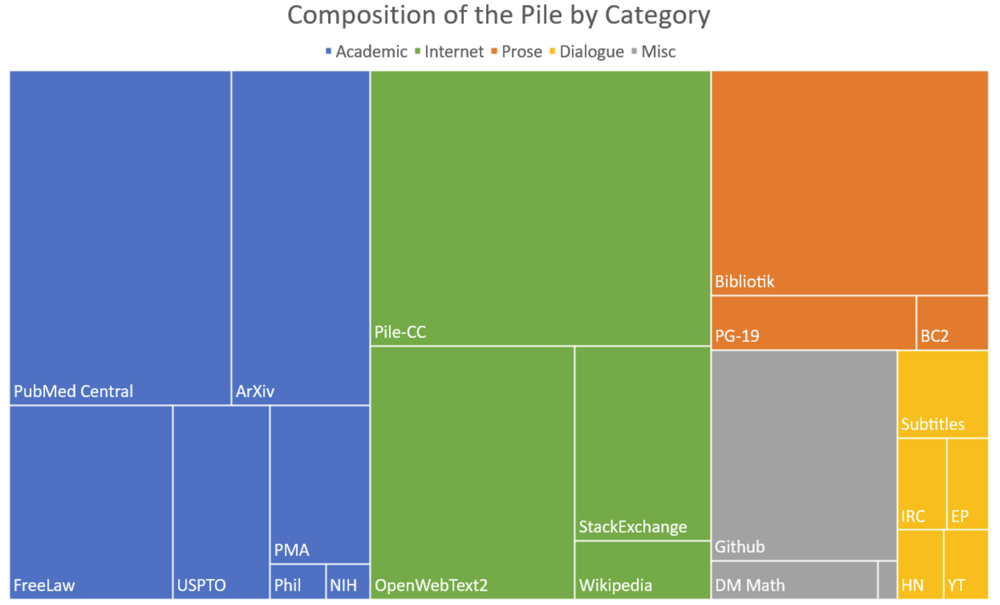

## LLM vs Agent {.center}

::: {.r-fit-text}
An LLM predicts the next token.
:::

::: {.fragment}
An agent adds goals, tools, and checks.
:::

## Objective

- Build a mental model of LLMs
- Separate model, agent, and tool
- Produce one strong E1 artifact

## How are LLMs created? {.smaller}

:::: {.columns}

::: {.column width="60%"}

```{mermaid}
flowchart TD
  A[Pretraining] --> B[Human alignment]
  B --> C[Model deployment]
  C --> D[Collect user interactions]
  D -->|update| B
```

:::

::: {.column width="40%"}

**Registry anchors:**

- R031/R032: foundations + few-shot
- R033: scaling behavior
- R034: compute-data trade-offs

:::

::::

## Training data intuition {.center}

{width="78%"}

::: {.smaller}
Visual adapted from the workshop_pe chapter deck (The Pile overview).
:::

## {.center auto-animate=true}

::: {.r-fit-text data-id="coreline"}
An LLM auto-regressively predicts the next token in a sequence of tokens.
:::

## {.center auto-animate=true}

::: {.r-fit-text data-id="coreline"}
An LLM <span class="highlight">auto-regressively</span> predicts the next token in a sequence of tokens.
:::

::: {.fragment}
*it repeats this step by step*
:::

## {.center auto-animate=true}

::: {.r-fit-text data-id="coreline"}
An LLM auto-regressively predicts the next <span class="highlight">token</span> in a sequence of tokens.
:::

::: {.fragment}
*token != word (can be sub-word or symbol)*
:::

## {.center auto-animate=true}

::: {.r-fit-text data-id="coreline"}
An LLM auto-regressively predicts the next token in a <span class="highlight">sequence of tokens</span>.
:::

::: {.fragment}
*the sequence is your current context window*
:::

## Core mechanism

An LLM auto-regressively predicts the next token in a sequence of tokens.

$$P(x_t | x_{<t}, \theta)$$

## What changes model behavior?

- Prompting changes context window
- Fine-tuning changes parameters
- Sampling settings change variability

## What changes agent behavior?

- Tool calls inject external state
- Plan/check loops enforce process
- Human escalation sets boundaries

## What is an agent?

```{mermaid}
flowchart TD
  U[User goal] --> P[Plan]
  P --> M[Model step]
  M --> T[Tool call if needed]
  T --> M
  M --> V[Verify against constraints]
  V -->|pass| O[Output]
  V -->|fail| P
```

## Context, tools, skills, memory

| Component | Question it answers | Typical failure |
|---|---|---|
| Context | What is this task now? | Missing constraints |
| Tools | What can I do externally? | Unverified tool output |
| Skills | Which procedure should I apply? | Wrong workflow |
| Memory | What should persist? | Stale carryover |

## Prompt anatomy example

```text
Role: You are a coding assistant for a field experiment.
Task: Label each quote as Trust, Price, or Service.
Context: Use only this codebook.
Constraint: Return strict JSON only.
Output schema: {"label":"...","confidence":0-1,"rationale_1_sentence":"..."}
Verification: If confidence < 0.65, return "needs_human_review": true.
```

## Hands-on: E1 prompt anatomy lab {background-color="black"}

- Inputs: weak prompt + anatomy checklist + use case
- Deliverable: before/after pair + short rationale
- Timebox/submission: 20/30/10, `/docs/live-exercises?exercise=E1`

## E1 evaluation rubric

- Core: usefulness/correctness/reproducibility/risk
- Diagnose weak prompts clearly
- Tighten constraints and output schema

## Common failure modes

- Vague task boundary
- Missing schema and check
- Assumptions stay implicit

## Optional extension

- Rewrite for a second audience
- Compare policy vs academic version

## Registry references (for this block) {.smaller}

- Foundations: R031, R032
- Scaling + compute: R033, R034
- Prompting personas: R005, R030

## Debrief

- Which assumption failed first?
- What evidence would falsify output?
- What should remain human-owned?
