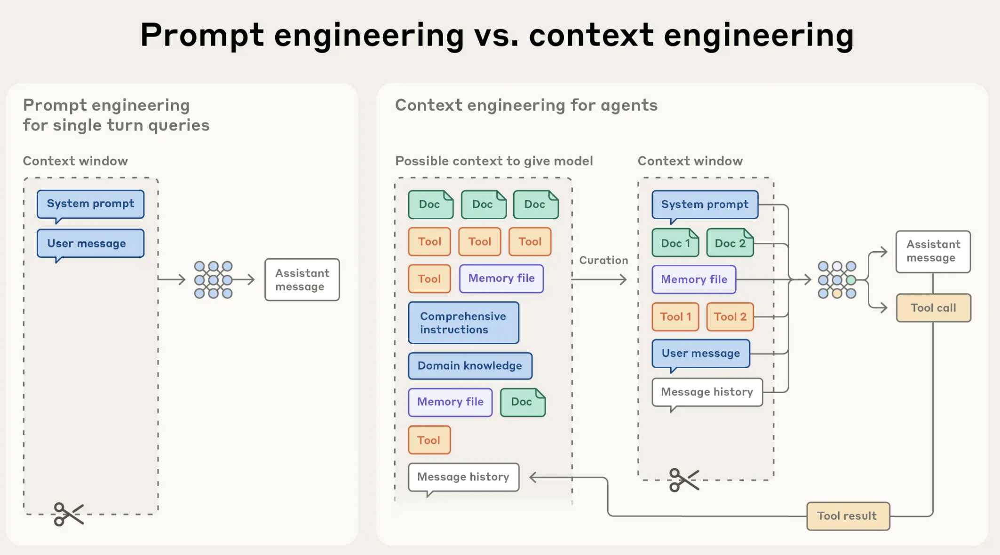
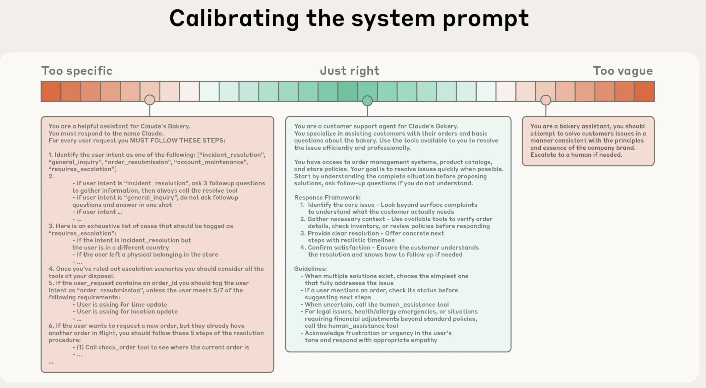

## Context is king {.center}

. . .

::: {.r-fit-text}
Engineer context, not just prompts.
:::

## From prompt to context engineering



## Context for coding agents

- Name things well (`main.py`, `estimate_arima()`, ...)
- Comments and documentation matter!

1) Write unit-test
2) Prompt agent to write code and to *test it*
3) Iterate until ✅

## {background-video="../../assets/videos/context.mp4" background-size="contain" background-video-loop="true"}

## Plan mode

::: {.r-fit-text}

Sometimes, the agent can write its own context

:::

## {background-video="../../assets/videos/plan_mode.mp4" background-size="contain" background-video-loop="true"}

## Housekeeping for better retrieval

| Messy | Clean |
|---|---|
| vague file names | descriptive file names |
| no folder map | `INDEX.md` per folder |

> Agents infer intent from names, hierarchy, and metadata

## Boundaries and Workarounds

| Boundary | Workaround | Required disclosure |
|---|---|---|
| personal data | redact + summarize | state data omitted |
| copyrighted text | use abstract/metadata | state evidence gaps |


## Context-window fatigue



## Token-economics

- Summary of context
- Split into multiple sessions with "handoff"

| Reduce "Intelligence" | Computations |
|---|---|
| lower reasoning effort | caching |
| weaker LLM | batching |


## Structured outputs

```json
{
  "text": "string",
  "rating": "integer"
}
```
Validate datatypes and required keys


## References

::: {#refs}

:::
