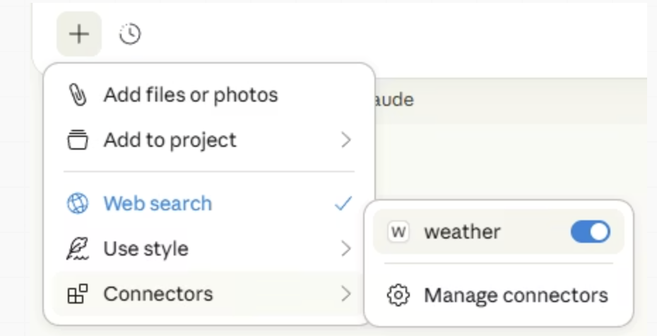

## Chapter Shift: User -> Builder [^s1]

We know how to use use tools ...

. . .

> ... but how do we build them?

[^s1]: Sources: @willisonAgenticPatterns; @yao2022react

## SKILL.md [^s3]

```markdown

<!-- Too verbose — the agent already knows what PDFs are -->
## Extract PDF text

PDF (Portable Document Format) files are a common file format that contains
text, images, and other content. To extract text from a PDF, you'll need to
use a library. pdfplumber is recommended because it handles most cases well.

<!-- Better — jumps straight to what the agent wouldn't know on its own -->
## Extract PDF text

Use pdfplumber for text extraction. For scanned documents, fall back to
pdf2image with pytesseract.

import pdfplumber

with pdfplumber.open("file.pdf") as pdf:
    text = pdf.pages[0].extract_text()
```

. . . 

SKILL.md is high level; Precision: **Use scripts!**

[^s3]: Sources: @agentskillsBestPractices


## Scripts Inside Skills [^s4]

```bash
# Agent-friendly script usage
python scripts/tool.py --help
python scripts/tool.py --input data.csv --format json
```

- Scripts should be standalone (agents love CLIs)
- Naming matters!
- warnings, errors, info messages become context ...

. . .

Use an AI agent to create skills: [`skill-creator`](https://github.com/anthropics/skills/tree/main/skills/skill-creator)

[^s4]: Sources: @agentskillsUsingScripts; @agentskillsEvaluatingSkills

## Build your own MCP server [^s5]

`weather.py`

```python

from mcp.server.fastmcp import FastMCP

# Initialize FastMCP server
mcp = FastMCP("weather")

def call_weather_api(city: str, date: str) -> dict[str, Any] | None:
    """Make a request to the Weather API"""
    headers = {"City": city, "Date": date}
    response = client.get(
      api_key=WEATHER_API_KEY,
      headers=headers,
      timeout=30.0)
      
      return response.json()

@mcp.tool()
async def get_weather(city: str, date: str) -> str:
    """Get weather information for a city.

    Args:
        city: Name of the city
        date: Date for which to get weather information; options are "today", "tomorrow", or "YYYY-MM-DD"
    """
    try:
      data = call_weather_api(city, date)
    except Exception as e:
      return f"Error fetching weather data: {str(e)}"
    
    return "\n---\n".join(data)

```

---

Run your server in a terminal:

```python
...

def main():
    # Initialize and run the server
    mcp.run(transport="stdio")


if __name__ == "__main__":
    main()
```

## Wire MCP to an Agent

In the settings of your agent (e.g. MCP servers, ...) add

```json
{
  "mcpServers": {
    "weather": {
      "command": "uv",
      "args": [
        "--directory",
        "/ABSOLUTE/PATH/TO/PARENT/FOLDER/weather",
        "run",
        "weather.py"
      ]
    }
  }
}
```

[^s5]: [MCP](https://modelcontextprotocol.io/docs/develop/build-server#quick-examples)

## {.center}




<!-- ## Dispatch Sub-Agents [^s7]

```{mermaid}
%%| fig-align: "center"
flowchart TD
  M[Manager Agent] --> R[Research Agent]
  M --> C[Coding Agent]
  R --> V[Verifier]
  C --> V
  V --> O[Integrated output]
```

[^s7]: Sources: @willisonAgenticPatterns; @yao2022react

## LangChain: Building Agent Systems [^s8]

- Build agent graph quickly
- Add routing and contracts
- Trace and debug execution

```python
from langchain.agents import create_agent
agent = create_agent(model="claude-sonnet-4-6", tools=[npv_tool])
```

[^s8]: Sources: @langchainDocs; @willisonAgenticPatterns -->

## References

::: {#refs}

:::