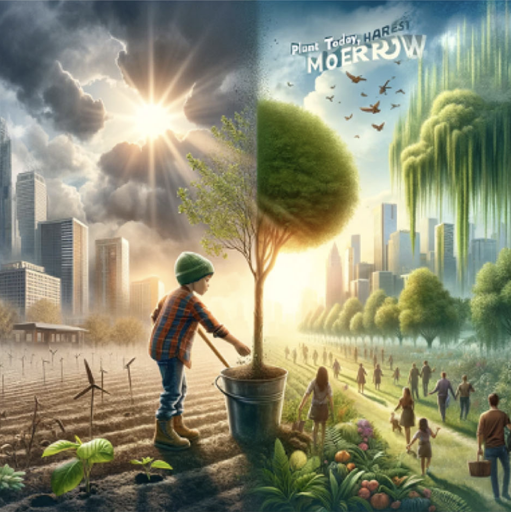
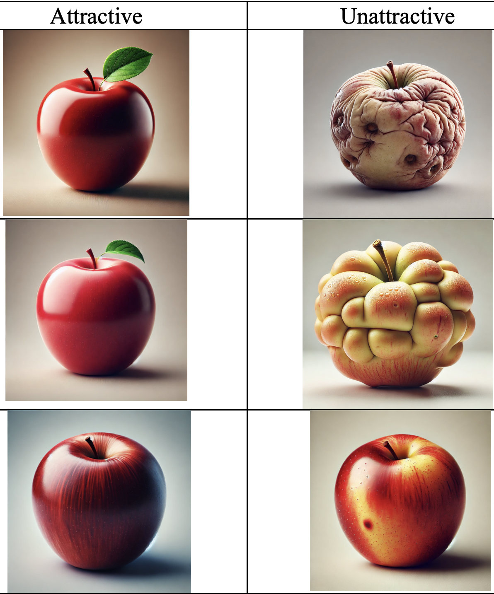
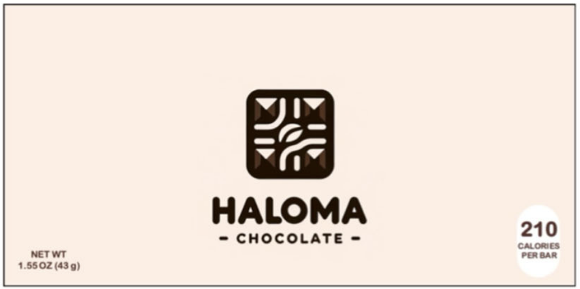
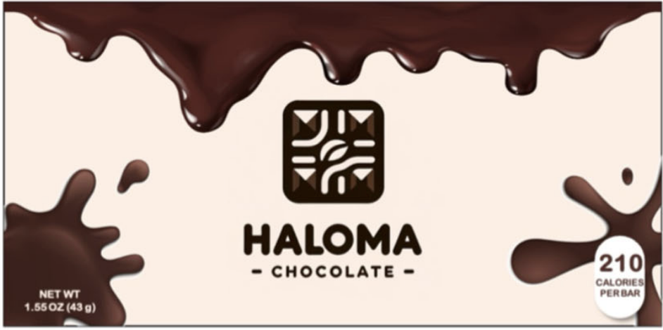

## DGPs, instruments, and AI {.center}

Let's think about a DGP that we measure with "instruments" (e.g. survey, experiment, administrative data, ...)

##


DGP | Instrument | AI example
----------------------|------------------|----------------------
Natural | Same | Generating stimuli images
Natural | New | AI qualitative interviewer
AI | Both | Synthetic respondents

## Natural DGP, same instruments

{fig-align="center"}

## Natural DGP, same instruments

{fig-align="center"}

## Natural DGP, same instruments

::: columns
::: column
{fig-align="center"}
:::

::: column
{fig-align="center"}
:::
:::

> "How complex do you think the design of the presented product is? (1=simple, 9=complex)" [@sarstedt2024using]

## Natural DGP, NEW instruments


Traditionally:

- quantitative data is "long" (large $N$, small $d$)
- qualitative data is "wide" (small $N$, large $d$)

. . .

> This mustn't be the case anymore!

## {background-iframe="https://conveo.ai/product" interactive=true}


## AI DGP

- Synthetic respondents
- AI decision making (e.g. AI online shoppers)

## Synthetic respondents {.smaller}

**Step 1: Covariates**

```{=html}
<style>
.var-hover {
  cursor: pointer;
  transition: all 0.2s ease;
}
.var-hover:hover {
  box-shadow: 0 0 8px rgba(0, 0, 0, 0.3);
  transform: scale(1.05);
}
.var-highlight {
  box-shadow: 0 0 12px rgba(0, 0, 0, 0.5) !important;
  border: 2px solid #333 !important;
  font-weight: bold;
}
</style>

<div style="font-size: 0.7em; margin-bottom: 1em;">
<table style="width: 100%; border-collapse: collapse; margin: 0.5em 0; table-layout: fixed;">
<thead>
<tr>
<th style="border: 1px solid #ddd; padding: 2px 3px; text-align: center; font-size: 0.85em; width: 10%;">id</th>
<th class="var-hover" data-var="age" style="border: 1px solid #ddd; padding: 2px 3px; text-align: center; background-color: #4caf50; color: white; font-size: 0.75em; width: 30%;">Age</th>
<th class="var-hover" data-var="charity" style="border: 1px solid #ddd; padding: 2px 3px; text-align: center; background-color: #ffeb3b; color: black; font-size: 0.75em; width: 30%;">Charity Frequency</th>
<th class="var-hover" data-var="income" style="border: 1px solid #ddd; padding: 2px 3px; text-align: center; background-color: #2196f3; color: white; font-size: 0.75em; width: 30%;">Income Level</th>
</tr>
</thead>
<tbody>
<tr>
<td style="border: 1px solid #ddd; padding: 2px 3px; text-align: center;">1</td>
<td class="var-hover" data-var="age" style="border: 1px solid #ddd; padding: 2px 3px; text-align: center; background-color: #4caf50; color: white;">45</td>
<td class="var-hover" data-var="charity" style="border: 1px solid #ddd; padding: 2px 3px; text-align: center; background-color: #ffeb3b; color: black;">Occasionally</td>
<td class="var-hover" data-var="income" style="border: 1px solid #ddd; padding: 2px 3px; text-align: center; background-color: #2196f3; color: white;">Middle</td>
</tr>
</tbody>
</table>
</div>

<script>
(function() {
  function setupVarHover() {
    const varMap = {
      'age': 'age-text',
      'charity': 'charity-text',
      'income': 'income-text'
    };
    
    const hoverElements = document.querySelectorAll('.var-hover');
    
    hoverElements.forEach(elem => {
      const varName = elem.getAttribute('data-var');
      if (!varName) return;
      
      const textId = varMap[varName];
      if (!textId) return;
      
      const textElem = document.getElementById(textId);
      if (!textElem) return;
      
      const newElem = elem.cloneNode(true);
      elem.parentNode.replaceChild(newElem, elem);
      
      newElem.addEventListener('mouseenter', function() {
        const target = document.getElementById(textId);
        if (target) target.classList.add('var-highlight');
      });
      
      newElem.addEventListener('mouseleave', function() {
        const target = document.getElementById(textId);
        if (target) target.classList.remove('var-highlight');
      });
    });
  }
  
  setupVarHover();
  
  if (document.readyState === 'loading') {
    document.addEventListener('DOMContentLoaded', setupVarHover);
  }
  
  if (typeof Reveal !== 'undefined') {
    Reveal.addEventListener('ready', setupVarHover);
    Reveal.addEventListener('slidechanged', function() {
      setTimeout(setupVarHover, 50);
    });
  }
  
  setTimeout(setupVarHover, 200);
})();
</script>
```

**Step 2: Background Story Prompt** [@moonVirtualPersonasLanguage2024]

```{=html}
<div style="margin-top: 1.5em; font-size: 0.75em;">
  <div style="background-color: #f8f9fa; border: 1px solid #dee2e6; border-radius: 6px; padding: 0.8em; max-width: 90%; margin: 0 auto;">
    <div style="margin-bottom: 0.6em;">
      <div style="font-weight: bold; color: #495057; margin-bottom: 0.2em; font-size: 0.9em;">Prompt:</div>
      <div style="background-color: white; padding: 0.5em; border-radius: 4px; border-left: 3px solid #007bff; font-size: 0.95em; line-height: 1.4;">
        <strong>BACKGROUND</strong> A <span id="age-text" style="background-color: #4caf50; color: white; padding: 2px 4px;">45-year-old</span> donor who gives to charity <span id="charity-text" style="background-color: #ffeb3b; color: black; padding: 2px 4px;">occasionally</span>, with a <span id="income-text" style="background-color: #2196f3; color: white; padding: 2px 4px;">middle income level</span>. <strong>QUESTION</strong> Would you donate to this new cause? <strong>ANSWER</strong>
      </div>
    </div>
    <div>
      <div style="font-weight: bold; color: #495057; margin-bottom: 0.2em; font-size: 0.9em;">Response:</div>
      <div style="background-color: #e7f3ff; padding: 0.5em; border-radius: 4px; border-left: 3px solid #28a745; font-size: 0.95em; line-height: 1.4;">
        Yes, I would consider donating, especially if I felt the cause was important.
      </div>
    </div>
  </div>
</div>
```

**Step 3: Record Answers**

## Why might this work? {.center}

::: {.notes}
- Explain algorithmic fidelity concept
- Discuss why LLMs can work as proxies
- Reference hybrid approach
:::

- Massive pre-training, emergent behavior [@argyle2023out; @dillionCanAILanguage2023]
- Hybrid approach [@arora2025ai]

## Mixed Evidence

::: {.notes}
- Comprehensive literature review table
- Key insights from recent research
:::


✅: @arora2025ai, @moonVirtualPersonasLanguage2024, @parkGenerativeAgentSimulations2024, @liFrontiersDeterminingValidity2024

0️⃣: @hermannSelfdrivingLabsNew2025, @goliFrontiersCanLarge2024, @gui2023challenge

❌: @linSixFallaciesSubstituting2025, @strombergBlindSpotsBroad2025


## Twin-2k-500 dataset


](../../assets/images/twin2k.png)




## References

::: {#refs}
:::
