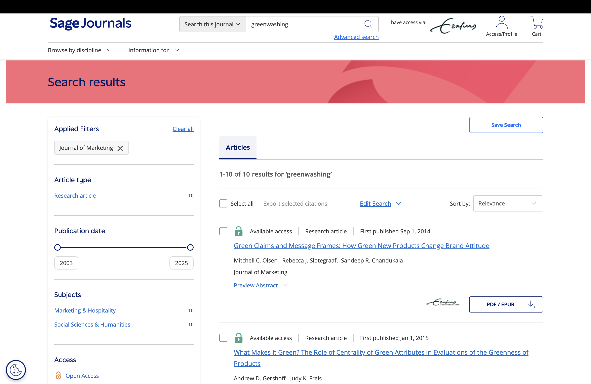
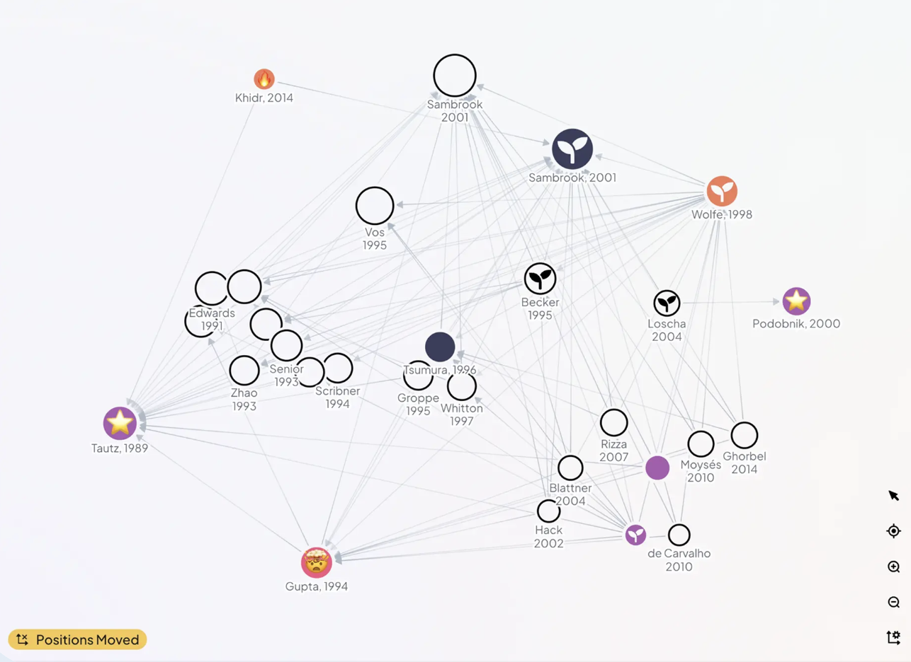

## (Literature) search is hard

... especially if there are paywalls

```{=html}
<div style="font-size:0.85em;">
<div style="border-left:5px solid #d23f31; padding:0.8em 1em; background:#fff4f2; margin-bottom:0.8em;">
<strong>Prompt:</strong> "Give me a literature table on <em>greenwashing</em> in top-tier marketing journals, with methods and key findings."
</div>
```

## {background-video="../../assets/videos/lit2.mp4" background-size="contain" background-video-loop="true"}


## It might still work though (kind of) {.smaller}


| Journal                                                | Paper                                    | Method      | Key finding                                                                                                                           |
| ------------------------------------------------------ | ---------------------------------------- | ----------- | ------------------------------------------------------------------------------------------------------------------------------------- |
| Journal of Consumer Research                           | Newman, Gorlin, Dhar (2014)              | Experiments | Green initiatives backfire when consumers infer self-serving motives; perceived hypocrisy drives negative evaluations.                |
| Journal of Marketing                                   | Luchs et al. (2010)                      | Experiments | “Sustainability liability”: green products are seen as less effective in strength-related categories → indirect driver of skepticism. |
| Journal of Consumer Psychology                         | Forehand & Grier (2003)                  | Experiments | Firm motive attribution → skepticism; ulterior motives reduce persuasion (core mechanism behind greenwashing perceptions).            |

‼️ [Wikipedia article "Greenwashing"](https://en.wikipedia.org/wiki/Greenwashing?utm_source=chatgpt.com)

##



## Some tips

*Prompt for notification about paywalls*

> Otherwise fails silently and reports based on abstract

*Provide list of journals*

> Quality ranking of research is weak so far (GPT likes researchgate, because its accessible!)

*Activate web-search*

> SOA models do this automatically; However, monitor whether it actually searches the web. Reduces hallucinations!

## False results

We are aware of false positives ("hallucinations")

(i.e. papers that do not exist but are "found")

. . .

For literature search, false negative are a huge problem too!

(i.e. papers that do exist but are not "found")

## Impose more structure on search



## {background-iframe="https://elicit.com/" interactive=true}

## {background-video="../../assets/videos/lit1.mp4" background-size="contain" background-video-loop="true"}


## Build a literature agent: Tools

arXiv MCP:

- Let AI search and download arXiv papers

Zotero MCP:

- Automatic RAG on papers!
- Citation via bibtex-key

## {background-video="../../assets/videos/zotero_moon_summary.mp4" background-size="contain" background-video-loop="true"}

## {background-image="../../assets/images/literature_claude.png" background-size="contain"}

## ⚠️ Copyright 

```{=html}
<div style="display:grid; grid-template-columns: 1fr 1fr; gap: 12px; font-size:0.82em;">
  <div style="border:2px solid #d23f31; border-radius:8px; padding:0.7em; background:#fff4f2;">
    <strong>Don't</strong><br>
    - Closed-source papers to LLM<br>
    - Trust AI citations blindly
  </div>
  <div style="border:2px solid #2f7d32; border-radius:8px; padding:0.7em; background:#f3fff4;">
    <strong>Do</strong><br>
    - Log Paywall blocks<br>
    - Use private AI models<br>
  </div>
</div>
```


## References

::: {#refs}
:::
